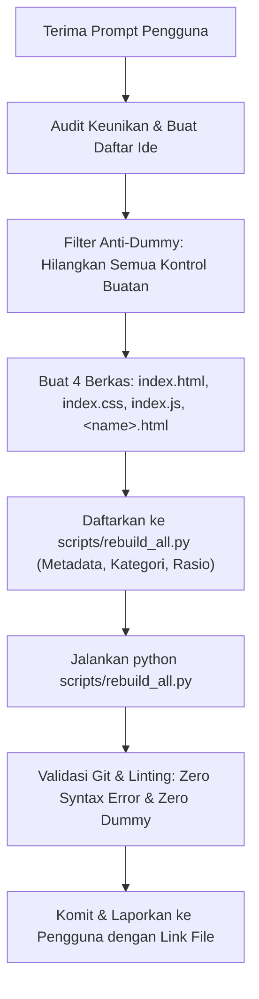

# Component Maker Skill (Anti-Dummy & Mass Creation Framework)

> **Mandatory Standard Operating Procedure for AI Agents**  
> Digunakan setiap kali diminta membuat, merancang, atau menambahkan komponen UI baru (baik satuan maupun batch 20–40 komponen) di direktori `ui/web/components/glass/`.

---

## 🚫 1. Anti-Dummy Creed (Deklarasi Anti-AI-Slop)

Kesalahan paling umum dari generasi AI adalah menambahkan elemen kontrol buatan (*artificial dummy controls*) atau dekorasi mubazir di luar batas komponen utama hanya untuk memicu animasi. **Hal ini dilarang keras.**

### Katalog Elemen Terlarang (*Hard Ban List*):
1. ❌ **DILARANG membuat Slider Simulasi Luar**:
   - *Contoh Buruk*: Menambahkan kotak di bawah komponen bertuliskan `Simulate Battery Level: [====O===]`.
   - *Solusi Benar*: Komponen harus beroperasi secara otonom (*live organic telemetry*) dengan fluktuasi data alami di background, ATAU jika komponen itu memang sebuah slider input, maka slider itu sendiri adalah komponen utamanya.
2. ❌ **DILARANG membuat Tombol Stepper / Trigger Tambahan**:
   - *Contoh Buruk*: Menaruh tombol `[-10%]`, `[Auto Pulse]`, `[+10%]` di bawah circular progress bar.
   - *Solusi Benar*: Progress bar berputar/berdenyut secara organik melalui interval data waktu nyata, atau menerima event langsung dari aksi drag/klik pada gauge itu sendiri.
3. ❌ **DILARANG membuat Hint Pills / Teks Petunjuk Melayang**:
   - *Contoh Buruk*: Menaruh pill `Click center button to bloom radial actions` atau `ACTIVE WORKSPACE NAVIGATION`.
   - *Solusi Benar*: Gunakan affordance visual natural (ikon plus, hover glow, cursor pointer, micro-scale). UI profesional tidak membutuhkan teks instruksi melayang untuk interaksi dasar.
4. ❌ **DILARANG menempelkan Telemetri Palsu yang Tidak Relevan**:
   - *Contoh Buruk*: Menempelkan baris pill `[Latency: 21ms] [Enclave: Active] [Mode: Berpikir]` di bawah foto avatar profil pengguna.
   - *Solusi Benar*: Kartu avatar cukup menampilkan avatar, status dot online/idle, nama, badge, dan avatar swarm yang relevan.
5. ❌ **DILARANG membuat Tombol Eksternal untuk Interaksi Objek 3D**:
   - *Contoh Buruk*: Tombol `[Flip Card (CVV)]` di bawah kartu kredit 3D.
   - *Solusi Benar*: Kartu itu sendiri yang dapat diklik (`cursor: pointer`) atau disentuh untuk membalik secara 3D.
6. ❌ **DILARANG membuat Placeholder Tidak Bermakna**:
   - *Contoh Buruk*: Teks `Lorem Ipsum`, `Card Title`, `Description here`, atau ikon tanpa label yang jelas.
   - *Solusi Benar*: Selalu gunakan salinan data realistis (*real-world contextual copy*), misalnya: "Quantum Enclave", "Bandwidth Spike Detected", "99.98% Uptime", "4920 8819 3200 7642".
7. ❌ **DILARANG menambahkan Tombol Gimmick di Bilah Navigasi**:
   - *Contoh Buruk*: Menaruh tombol `[Acak]` / `[Randomize]` di filter tab showcase yang merusak konsistensi tata letak.

---

## 🎨 2. Batch Creation Framework (Prosedur 20–40 Komponen Baru)

Ketika pengguna meminta batch komponen (misalnya: *"tambahkan 20-40 komponen baru, randomize, kreatif, tidak serupa"*):

### A. Matriks Diferensiasi Radikal (Anti-Repetisi)
Jika diminta membuat komponen dari kategori yang sudah ada (misal: dropdown atau cards), **DILARANG** membuat kloningan dengan hanya mengubah warna atau teks. Ubah paradigma fundamentalnya:

| Kategori | Yang Sudah Ada | Komponen Baru yang Dibenarkan (Contoh Paradigma Baru) |
|---|---|---|
| **Selector / Dropdown** | Single select dropdown standar | • **Command Palette (Ctrl+K)** dengan keyboard navigation<br>• **Hierarchical Tree Select** dengan collapse/expand<br>• **Segmented Wheel / Dial Selector** bergaya futuristik |
| **Card** | KPI trend card, Frosted folder | • **Audio Waveform Visualizer Card** dengan scrubber<br>• **Live Log Stream Terminal Card** dengan auto-scroll<br>• **Split-View Comparison Card** dengan slider perbandingan |
| **Input** | OTP input 6-digit, standard input | • **Tag / Token Multi-Input** dengan auto-complete chips<br>• **Markdown Syntax Highlighting Textarea** dengan glass toolbar<br>• **Currency / Crypto Exchange Input** dengan dual-token switcher |
| **Pickers** | Color picker canvas | • **Date Range Heatmap Picker** (seperti grafik kontribusi GitHub)<br>• **File Upload Dropzone dengan Circular Gauge Progress** |
| **Loaders / Gauges** | Circular gauge, progress bar | • **Biometric Fingerprint Scanner** dengan laser scanning line<br>• **Multi-Thread CPU Core Grid Gauge** (8-core telemetry display) |

### B. Rumus Konseptualisasi Tiap Komponen
Setiap komponen harus lolos 3 pertanyaan verifikasi sebelum dibuat:
1. **Fungsi Nyata**: *"Apa tugas spesifik komponen ini di aplikasi web modern?"*
2. **Affordance Intuitif**: *"Apakah pengguna langsung paham cara berinteraksi tanpa tombol bantuan eksternal?"*
3. **Purity of Form**: *"Apakah seluruh elemen di dalam komponen ini memang bagian dari anatominya, bukan tempelan?"*

---

## 🏗️ 3. Arsitektur Berkas Wajib (The 4-File Pattern)

Setiap komponen baru dibuat di `ui/web/components/glass/<kebab-name>/` dan wajib memiliki 4 berkas mandiri:

```text
ui/web/components/glass/<kebab-name>/
├── index.html            # File markup bersih (memuat css.css, index.css, index.js)
├── index.css             # File stylesheet khusus komponen (scoped classes)
├── index.js              # File logika interaksi murni & autonomous state
└── <kebab-name>.html     # File All-in-One mandiri (self-contained inline style & script)
```

### Standar Teknis Tiap Berkas:
1. **`index.html`**:
   - Memuat token global: `<link rel="stylesheet" href="../css.css">`.
   - Memuat style lokal: `<link rel="stylesheet" href="index.css">`.
   - Menggunakan Lucide icons: `<script src="https://unpkg.com/lucide@latest"></script>`.
   - Memuat script lokal di akhir body: `<script src="index.js"></script>`.
2. **`index.css`**:
   - Baris pertama: `@import url('../css.css');`.
   - Nama class harus menggunakan namespace unik: `.<kebab-name>-*`.
   - Specular border asimetris:
     ```css
     border: 1px solid transparent;
     border-top-color: var(--glass-border-top, rgba(255, 255, 255, 0.28));
     border-left-color: var(--glass-border-side, rgba(255, 255, 255, 0.12));
     border-right-color: var(--glass-border-side, rgba(255, 255, 255, 0.12));
     border-bottom-color: var(--glass-border-bottom, rgba(255, 255, 255, 0.04));
     ```
   - Backdrop blur standar: `backdrop-filter: blur(24px) saturate(160%);`.
3. **`index.js`**:
   - Dilarang membuat event listener ke elemen dummy yang tidak ada.
   - Gunakan `addEventListener`, dukung keyboard aksesibilitas (`Enter`, `Space`, `Escape`).
   - Jika komponen bersifat visual telemetry, gunakan `setInterval` halus dengan fluktuasi realistis di background.
4. **`<kebab-name>.html`**:
   - Versi mandiri (*All-in-One*) yang menggabungkan seluruh CSS dan JS untuk iframe preview di showcase maupun download pengguna.

---

## ⚡ 4. Aturan Desain Glass Dark Premium

Komponen **wajib** memenuhi standar estetika tinggi:
1. **Palet Warna**:
   - Deep Void Canvas: `#08080C` atau `#060709`.
   - Primary Surface: `rgba(255, 255, 255, 0.05)` s/d `0.08`.
   - Elevasi / Interaktif: `rgba(255, 255, 255, 0.10)` s/d `0.18`.
   - Aksen Utama: Cyan (`#38BDF8`), Purple (`#A855F7`), Emerald (`#10B981`), Amber (`#F59E0B`).
2. **Motion & Transitions**:
   - Gunakan kurva spring natural: `cubic-bezier(0.34, 1.25, 0.64, 1)` untuk pop-out / hover.
   - Durasi mikro: `150ms – 280ms`.
   - Hover state: `transform: translateY(-2px)` atau `scale(1.02)` dengan peningkatan inset specular glow.
3. **Anti-Overflow & Responsivitas**:
   - Selalu berikan `box-sizing: border-box;`.
   - Input dan teks flexbox wajib memiliki `min-width: 0`.
   - Komponen harus stabil dan tidak terpotong pada lebar 320px hingga desktop.

---

## 🔍 5. Alur Eksekusi & Protokol QA Baku

Setiap kali AI Agent memproduksi komponen baru:



### Checklist QA Sebelum Melaporkan ke Pengguna:
- [ ] Apakah ada tombol "Simulate", slider simulator, atau tombol trigger eksternal? (Jika ada: **HAPUS SEGERA**).
- [ ] Apakah ada teks instruksi melayang seperti "Click here to bloom"? (Jika ada: **HAPUS SEGERA**).
- [ ] Apakah komponen memiliki 4 berkas lengkap (`index.html`, `index.css`, `index.js`, `<name>.html`)?
- [ ] Apakah sudah terdaftar di `glass_components_metadata` pada `scripts/rebuild_all.py`?
- [ ] Apakah perintah `python scripts/rebuild_all.py` berjalan sukses tanpa error?
- [ ] Apakah layout responsif dan bebas overflow?
